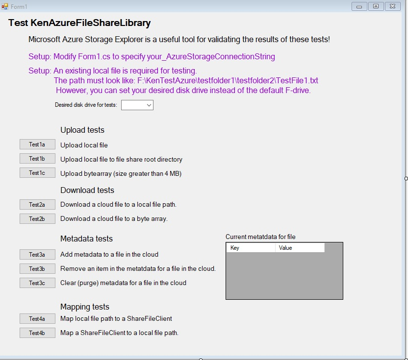

# KenTestAzureFileShareV2
## Warranty Disclaimer:
The software is provided "AS IS," without any warranties, express or implied. 
IN NO EVENT SHALL THE AUTHORS OR COPYRIGHT HOLDERS BE LIABLE FOR ANY CLAIM, DAMAGES OR OTHER LIABILITY, 
WHETHER IN AN ACTION OF CONTRACT, TORT OR OTHERWISE, ARISING FROM, OUT OF OR IN CONNECTION WITH THE SOFTWARE OR 
THE USE OR OTHER DEALINGS IN THE SOFTWARE.
## Purpose
This is a Windows application to test KenAzureFileShareLibrary which can also be found on GitHub.
Ken's library simplifies using some functionality in the The official Azure Storage SDK for .NET.   
These are the most useful methods in this library; examples are provided later in this document.
- GetShareClient - gives authorization which is used directly or indirectly in all other methods.
- UploadFile - from a local file, from a byte array
- DownloadFile - to a local file, to a byte array
- DownloadCloudDirectoryToLocalDirectory
- UploadDirectoryContentToCloud
- GetListAllCloudFiles (optionally traverseAllSubdirectories)
- GetListAllCloudDirectories (optionally traverseAllSubdirectories)
- GetMetadataDictionary - for a cloud file or cloud directory
- AddMetadataItem - for a cloud file or cloud directory
- RemoveMetadataItem - for a cloud file or cloud directory
- ClearMetadata - for a cloud file or cloud directory
- Methods in KenMapping class:
    - MapLocalFilePathToCloudFile
    - MapLocalDirectoryPathToCloudDirectory
    - MapCloudFileToLocalFilePath
    - MapCloudDirectoryToLocalDirectoryPath

## Terminology 
**ShareClient:**          The ShareClient allows you to manipulate Azure Storage shares and their directories and files.    
                          The constructor requires the Azure authorization keys.   (Ken also calls it FileShare)   
**ShareFileClient:**      represents a FILE in the cloud.      (Ken also calls it CloudFile)   
**ShareDirectoryClient:** represents a DIRECTORY in the cloud. (Ken also calls it CloudDirectory)

**Note 1:** When you "Create" a ShareFileClient or ShareFileDirectory that cloud object is not physically created!   
A physical file/directory gets created when you act on the object (ex: Upload will create the physical file).

**Note 2:** Perhaps Ken should not have used the term FileShare for a ShareClient.  
Note that ShareClient (a.k.a. FileShare) is NOT the same as a ShareFileClient (a.k.a. CloudFile).

## Visual Studio Setup
Steps:
 1. Clone KenAzureFileShareLibrary from GitHub into a chosen top level directory.
 1. In Visual Studio, Build KenAzureFileShareLibrary.
 1. Clone KenTestAzureFileShareV2 from GitHub into the same top level directory.
    1. Open KenTestAzureFileShareV2 with Visual Studio.
    1. Both projects that were cloned should be present.
    1. Build Solution to make sure there are no errors.
    1. Update Form1.cs with <your_azureStorageConnectionString>.
    1. Build Solution and start the app.

## Azure Setup
You must have an Azure account with a defined storage account.   
Your **azureStorageConnectionString** can be found on the Azure portal at:    
&nbsp;&nbsp;&nbsp;&nbsp;&nbsp;&nbsp;&nbsp;your_azure_storageaccount/Data storage/Security+networking/Access keys.    
Your **fileShareName** (after you create one) can be found on the Azure portal at:    
&nbsp;&nbsp;&nbsp;&nbsp;&nbsp;&nbsp;&nbsp;your_azure_storageaccount/Data storage/File shares.

## Screen Image
